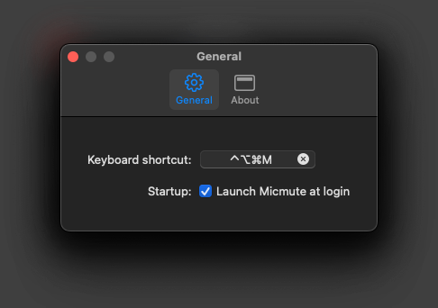
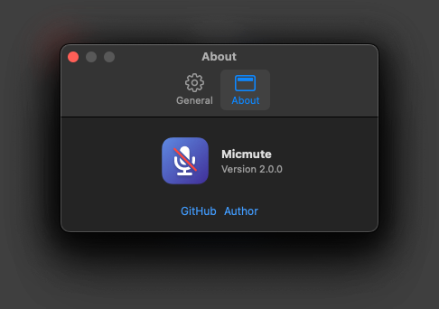
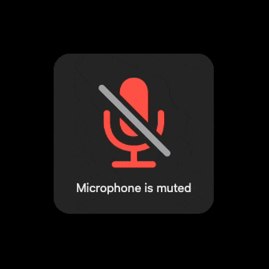

  

## About 
Micmute is native & lightweight menu bar application for toggling microphone mute.

## Requirements
Micmute require macOS 14 or latest.

## Install
[Download](https://github.com/rokartur/micmute/releases/download/Production/Micmute.zip)

## Screenshots

  
  

  

