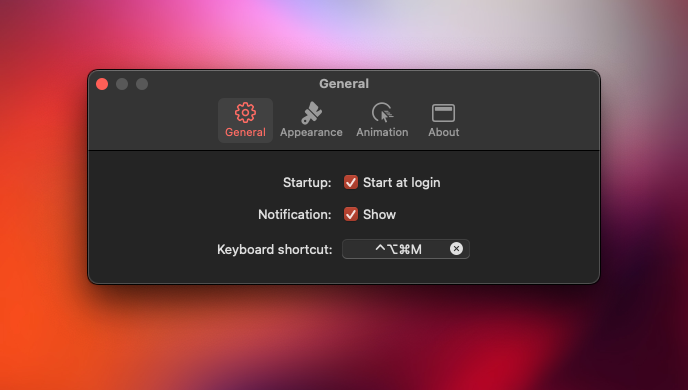
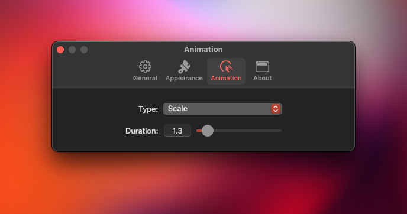

  

## About 
Micmute is native & lightweight menu bar application for toggling microphone mute.

## Requirements
Micmute require macOS 14 or latest.

## Install
[Download](https://github.com/rokartur/Micmute/releases/download/v2.1.1/Micmute.zip)

## Usage

  
  
  

## Package dependencies
- [KeyboardShortcuts](https://github.com/sindresorhus/KeyboardShortcuts)
- [LaunchAtLogin](https://github.com/sindresorhus/LaunchAtLogin-Legacy)
- [SettingsAccess](https://github.com/orchetect/SettingsAccess)
