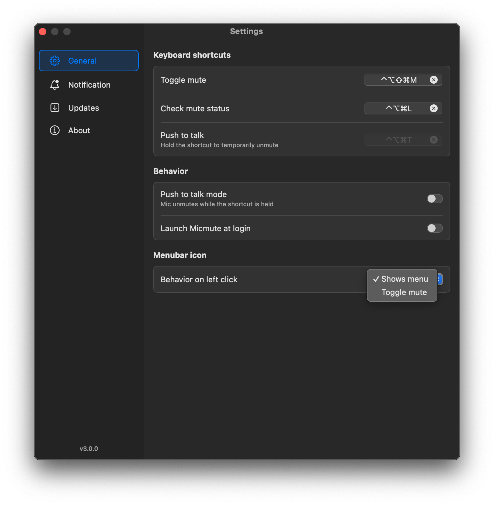
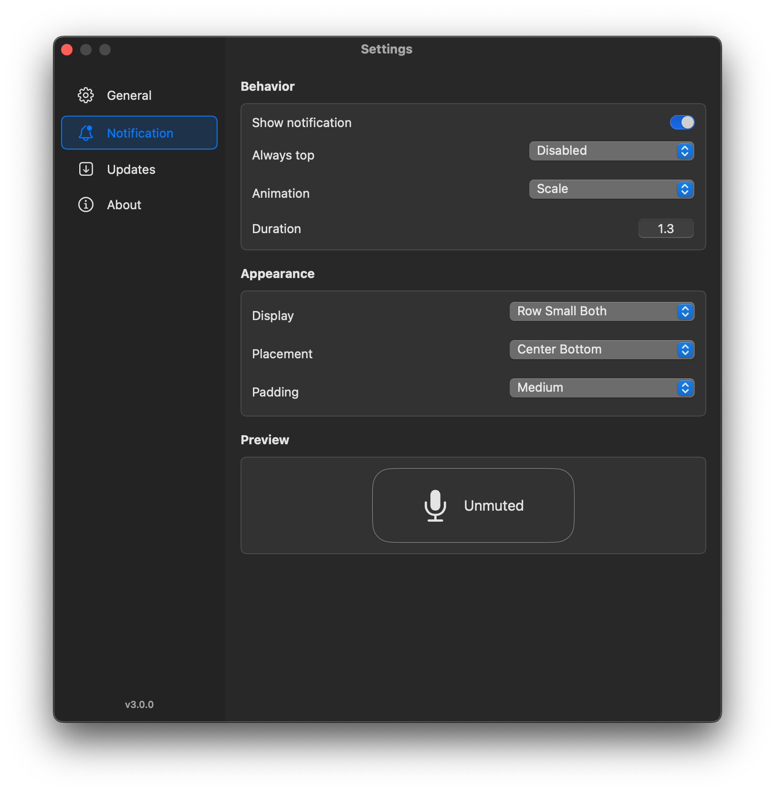

<div align="center">
	
	<h1>Micmute</h1>
	<p>
		<b>Toggling microphone mute in any app</b>
	</p>
</div>

## Download

[**Latest release**](https://github.com/rokartur/Micmute/releases/latest)

<sup>Requires macOS 14 or later.</sup>

> [!IMPORTANT]
> 
> <br>
> The application is secure. This message appears because I don't have an Apple Developer license (too expensive). To run the application, enter the following command in the terminal.
```
xattr -rd com.apple.quarantine /Applications/Micmute.app
```


## Features
- Select input device to mute/unmute
- Toggle mute with click in menu bar
- Toggle mute with global keyboard shortcut
- Show microphone status in menu bar
- Check mute status
- Push to talk
- Always top notification
- Highly customizable notification

## Screenshots
<div align="center">
  
  
</div>

## Package dependencies
- [AlinFoundation](https://github.com/alienator88/AlinFoundation)
- [KeyboardShortcuts](https://github.com/sindresorhus/KeyboardShortcuts)
- [LaunchAtLogin](https://github.com/sindresorhus/LaunchAtLogin-Legacy)
- [MacControlCenterUI](https://github.com/orchetect/MacControlCenterUI)


